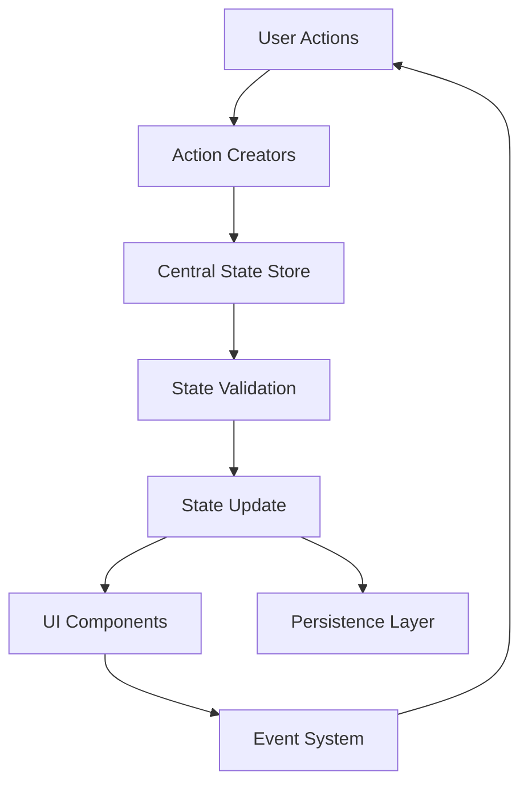
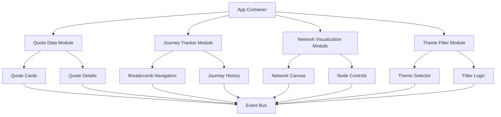
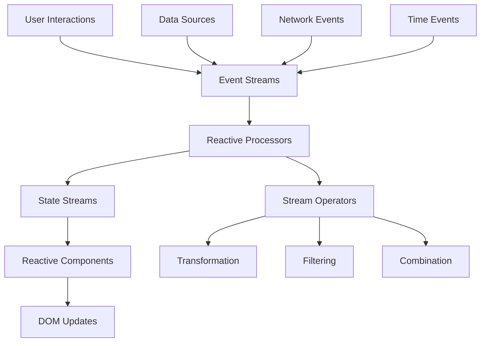

# Contextual Quote Journey: JavaScript State Management Architectural Options

## Executive Summary

This document presents three distinct architectural approaches for managing JavaScript data and state in the Contextual Quote Journey system for the Miller Analysis project. Each option is evaluated using a Point of Scoring (PoS) system across five key criteria to determine the most suitable approach for implementing the "Labyrinth of Interpretation" concept.

## Current Implementation Analysis

Based on analysis of the existing codebase, the current implementation features:

- **Simple QuoteCarousel class** in [`main.js`](js/main.js:1) with basic quote rotation
- **Static quote data** hardcoded in JavaScript array
- **Limited state management** with only current index tracking
- **No network visualization** or journey tracking
- **Basic DOM manipulation** for quote display and form handling
- **Tailwind CSS** for styling with custom CSS variables for Oxford academic aesthetic

The new system must replace this simple carousel with a sophisticated network-based navigation experience while maintaining the existing visual design and user experience.

---

## Option 1: Centralized State Management Pattern

### Architecture Overview

A centralized state management approach uses a single, authoritative state object that manages all application data and provides controlled access through defined methods. This pattern implements a unidirectional data flow similar to Redux but simplified for the specific needs of the Contextual Quote Journey.

### Core Architecture



### Core Classes and Responsibilities

#### QuoteJourneyState (Central Store)
```javascript
class QuoteJourneyState {
  constructor() {
    this.state = {
      // Data state
      quotes: [],
      themes: [],
      connections: [],
      
      // Navigation state
      currentQuoteId: null,
      journeyHistory: [],
      journeyFuture: [],
      visitedQuotes: new Set(),
      
      // UI state
      activeThemeFilter: 'all',
      networkVisible: false,
      breadcrumbs: [],
      relatedQuotesVisible: false,
      
      // User preferences
      preferences: {
        animationSpeed: 'normal',
        showNetworkOnLoad: false,
        autoSaveJourney: true,
        preferredDifficulty: 'all'
      }
    };
    
    this.subscribers = new Set();
    this.middleware = [];
  }
  
  // State access methods
  getState() { return this.state; }
  getQuotes() { return this.state.quotes; }
  getCurrentQuote() { 
    return this.state.quotes.find(q => q.id === this.state.currentQuoteId);
  }
  
  // State mutation methods
  dispatch(action) {
    // Apply middleware
    let processedAction = action;
    for (const middleware of this.middleware) {
      processedAction = middleware(processedAction, this.state);
    }
    
    // Validate and update state
    const newState = this.reducer(this.state, processedAction);
    if (this.validateState(newState)) {
      this.state = newState;
      this.notifySubscribers();
      this.persistState();
    }
  }
  
  // Subscription system
  subscribe(callback) {
    this.subscribers.add(callback);
    return () => this.subscribers.delete(callback);
  }
  
  notifySubscribers() {
    this.subscribers.forEach(callback => callback(this.state));
  }
}
```

#### Action Creators
```javascript
const QuoteJourneyActions = {
  navigateToQuote: (quoteId, connectionType) => ({
    type: 'NAVIGATE_TO_QUOTE',
    payload: { quoteId, connectionType, timestamp: Date.now() }
  }),
  
  setThemeFilter: (themeId) => ({
    type: 'SET_THEME_FILTER',
    payload: { themeId }
  }),
  
  toggleNetworkVisibility: () => ({
    type: 'TOGGLE_NETWORK_VISIBILITY'
  }),
  
  updateJourneyHistory: (history) => ({
    type: 'UPDATE_JOURNEY_HISTORY',
    payload: { history }
  }),
  
  loadQuoteData: (quotes, themes, connections) => ({
    type: 'LOAD_QUOTE_DATA',
    payload: { quotes, themes, connections }
  })
};
```

#### State Reducer
```javascript
const quoteJourneyReducer = (state, action) => {
  switch (action.type) {
    case 'NAVIGATE_TO_QUOTE':
      return {
        ...state,
        currentQuoteId: action.payload.quoteId,
        journeyHistory: [...state.journeyHistory, {
          quoteId: action.payload.quoteId,
          connectionType: action.payload.connectionType,
          timestamp: action.payload.timestamp
        }],
        journeyFuture: [],
        visitedQuotes: new Set([...state.visitedQuotes, action.payload.quoteId])
      };
    
    case 'SET_THEME_FILTER':
      return {
        ...state,
        activeThemeFilter: action.payload.themeId,
        currentQuoteId: null // Reset current quote when filtering
      };
    
    case 'TOGGLE_NETWORK_VISIBILITY':
      return {
        ...state,
        networkVisible: !state.networkVisible
      };
    
    case 'LOAD_QUOTE_DATA':
      return {
        ...state,
        quotes: action.payload.quotes,
        themes: action.payload.themes,
        connections: action.payload.connections
      };
    
    default:
      return state;
  }
};
```

#### UI Components
```javascript
class QuoteDisplay {
  constructor(stateStore) {
    this.stateStore = stateStore;
    this.element = document.querySelector('#active-quote');
    this.unsubscribe = null;
  }
  
  render() {
    const state = this.stateStore.getState();
    const currentQuote = this.stateStore.getCurrentQuote();
    
    if (currentQuote) {
      this.updateContent(currentQuote);
      this.updateThemes(currentQuote.themes);
      this.updateMetadata(currentQuote.metadata);
    }
  }
  
  mount() {
    this.unsubscribe = this.stateStore.subscribe(() => this.render());
    this.render();
  }
  
  unmount() {
    if (this.unsubscribe) {
      this.unsubscribe();
    }
  }
}

class NetworkVisualization {
  constructor(stateStore, canvasElement) {
    this.stateStore = stateStore;
    this.canvas = canvasElement;
    this.ctx = canvasElement.getContext('2d');
    this.unsubscribe = null;
  }
  
  render() {
    const state = this.stateStore.getState();
    const filteredData = this.getFilteredData(state);
    
    this.clearCanvas();
    this.drawConnections(filteredData.connections);
    this.drawNodes(filteredData.quotes, state.currentQuoteId);
    this.highlightJourneyPath(state.journeyHistory);
  }
}

class JourneyControls {
  constructor(stateStore) {
    this.stateStore = stateStore;
    this.element = document.querySelector('#journey-controls');
    this.unsubscribe = null;
  }
  
  render() {
    const state = this.stateStore.getState();
    this.updateBackButton(state.journeyHistory.length > 1);
    this.updateForwardButton(state.journeyFuture.length > 0);
    this.updateBreadcrumbs(state.journeyHistory);
  }
}
```

### Data Flow Pattern

1. **User Interaction** → Action Creator → Action Object
2. **Action Object** → State Store → Middleware Processing
3. **State Store** → Reducer Function → State Validation
4. **Validated State** → Component Notification → UI Updates
5. **State Changes** → Persistence Layer → Local Storage

### State Mutation Approach

- **Immutable Updates**: All state changes create new objects rather than mutating existing state
- **Validation Layer**: Schema validation ensures state integrity
- **Middleware System**: Pluggable middleware for logging, analytics, etc.
- **Persistence**: Automatic state persistence to localStorage
- **Time Travel**: Journey history enables undo/redo functionality

### Integration with Existing Codebase

**Advantages:**
- Gradual migration path from existing [`QuoteCarousel`](js/main.js:2) class
- Maintains existing CSS classes and styling approach
- Compatible with current HTML structure in [`index.html`](index.html:116)
- Preserves Tailwind CSS usage and custom CSS variables

**Migration Strategy:**
1. Replace hardcoded quotes array with state-driven data loading
2. Enhance existing insight cards with state-connected components
3. Add network visualization alongside existing carousel view
4. Maintain backward compatibility during transition

### Performance Characteristics

**Strengths:**
- **Predictable Performance**: Centralized state reduces unnecessary re-renders
- **Optimized Updates**: Components only re-render when relevant state changes
- **Memory Efficiency**: Single state object prevents data duplication
- **Batch Updates**: Multiple state changes can be batched for better performance

**Potential Issues:**
- **Initial Learning Curve**: More complex than current simple implementation
- **Overhead**: Small performance overhead for simple state changes
- **Memory Usage**: State history for time travel increases memory usage

### Scalability Considerations

**For Scaling Quotes:**
- Efficient lookup through Map structures in state
- Lazy loading for large quote datasets
- Virtualized rendering for network visualization
- Pagination for quote collections

**For Scaling Features:**
- Middleware system allows easy feature addition
- Plugin architecture for custom functionality
- Event system supports third-party integrations
- Modular component structure enables feature isolation

### Implementation Complexity

**High-Level Components (3-4 days):**
- State store implementation
- Basic UI components
- Integration with existing code

**Medium-Level Components (2-3 days):**
- Advanced network visualization
- Journey tracking system
- Persistence layer optimization

**Low-Level Components (1-2 days):**
- Action creators and reducers
- Basic component rendering
- Event handling

**Total Implementation Timeline:** 6-9 days

### Required Dependencies/Libraries

**Core Dependencies:**
- No external libraries required (vanilla JavaScript)
- Optional: Immutable.js for state immutability helpers
- Optional: Lodash for utility functions

**Development Dependencies:**
- Build tools for bundling (if needed)
- Testing framework (Jest, etc.)
- Development server with hot reload

---

## Option 2: Modular Component-Based Pattern

### Architecture Overview

A modular component-based pattern organizes the application into self-contained components that manage their own state and communicate through well-defined interfaces. This approach emphasizes encapsulation and reusability while maintaining clear data flow boundaries.

### Core Architecture



### Core Classes and Responsibilities

#### QuoteDataModule
```javascript
class QuoteDataModule {
  constructor() {
    this.quotes = new Map();
    this.themes = new Map();
    this.connections = new Map();
    this.loaded = false;
    this.subscribers = new Set();
  }
  
  // Data management
  async loadData(dataUrl) {
    try {
      const response = await fetch(dataUrl);
      const data = await response.json();
      
      this.processData(data);
      this.loaded = true;
      this.notifySubscribers('dataLoaded', data);
    } catch (error) {
      this.notifySubscribers('dataError', error);
    }
  }
  
  processData(data) {
    // Build efficient lookup maps
    this.quotes = new Map(data.quotes.map(q => [q.id, q]));
    this.themes = new Map(data.themes.map(t => [t.id, t]));
    this.connections = new Map(data.connections.map(c => [c.id, c]));
    
    // Build relationship maps
    this.buildRelationshipMaps();
  }
  
  // Query methods
  getQuote(id) { return this.quotes.get(id); }
  getTheme(id) { return this.themes.get(id); }
  getConnections(quoteId) { return this.connections.get(quoteId) || []; }
  getQuotesByTheme(themeId) { 
    return Array.from(this.quotes.values()).filter(q => q.themes.includes(themeId));
  }
  
  // Event system
  subscribe(event, callback) {
    if (!this.subscribers.has(event)) {
      this.subscribers.set(event, new Set());
    }
    this.subscribers.get(event).add(callback);
  }
  
  notifySubscribers(event, data) {
    if (this.subscribers.has(event)) {
      this.subscribers.get(event).forEach(callback => callback(data));
    }
  }
}
```

#### JourneyTrackerModule
```javascript
class JourneyTrackerModule {
  constructor(eventBus) {
    this.eventBus = eventBus;
    this.currentPath = [];
    this.visitedQuotes = new Set();
    this.journeyHistory = [];
    this.maxJourneyLength = 10;
  }
  
  // Journey management
  navigateToQuote(quoteId, connectionType) {
    if (this.currentPath.length > 0) {
      const lastQuote = this.currentPath[this.currentPath.length - 1];
      if (lastQuote.quoteId === quoteId) return; // Already at this quote
    }
    
    const journeyStep = {
      quoteId,
      connectionType,
      timestamp: Date.now()
    };
    
    this.currentPath.push(journeyStep);
    this.visitedQuotes.add(quoteId);
    
    this.eventBus.emit('journeyUpdated', {
      path: [...this.currentPath],
      visitedQuotes: new Set(this.visitedQuotes)
    });
  }
  
  goBack() {
    if (this.currentPath.length <= 1) return;
    
    const currentStep = this.currentPath.pop();
    this.eventBus.emit('journeyStepBack', {
      removedStep: currentStep,
      newPath: [...this.currentPath]
    });
  }
  
  goForward() {
    // Implementation for forward navigation
  }
  
  reset() {
    this.currentPath = [];
    this.visitedQuotes.clear();
    this.eventBus.emit('journeyReset');
  }
  
  // Analytics
  getJourneyInsights() {
    return {
      length: this.currentPath.length,
      themes: this.getExploredThemes(),
      nodesVisited: this.visitedQuotes.size,
      diversity: this.calculateThematicDiversity()
    };
  }
}
```

#### NetworkVisualizationModule
```javascript
class NetworkVisualizationModule {
  constructor(canvasElement, quoteDataModule, eventBus) {
    this.canvas = canvasElement;
    this.ctx = canvasElement.getContext('2d');
    this.quoteData = quoteDataModule;
    this.eventBus = eventBus;
    
    this.nodes = [];
    this.connections = [];
    this.selectedNode = null;
    this.hoveredNode = null;
    
    this.setupEventListeners();
  }
  
  // Rendering methods
  render() {
    this.clearCanvas();
    this.drawConnections();
    this.drawNodes();
    this.drawLabels();
  }
  
  drawNodes() {
    this.nodes.forEach(node => {
      const isSelected = node === this.selectedNode;
      const isHovered = node === this.hoveredNode;
      const isVisited = this.isNodeVisited(node.id);
      
      this.drawNode(node, { isSelected, isHovered, isVisited });
    });
  }
  
  drawConnections() {
    this.connections.forEach(conn => {
      const isHighlighted = this.isConnectionInPath(conn);
      this.drawConnection(conn, { isHighlighted });
    });
  }
  
  // Interaction handling
  handleCanvasClick(event) {
    const clickPoint = this.getClickPosition(event);
    const clickedNode = this.findNodeAtPoint(clickPoint);
    
    if (clickedNode) {
      this.selectNode(clickedNode);
      this.eventBus.emit('nodeSelected', { node: clickedNode });
    }
  }
  
  // Filtering and highlighting
  filterByTheme(themeId) {
    if (themeId === 'all') {
      this.updateFilteredData(this.quoteData.getAllQuotes());
    } else {
      const filteredQuotes = this.quoteData.getQuotesByTheme(themeId);
      this.updateFilteredData(filteredQuotes);
    }
    this.render();
  }
  
  highlightJourneyPath(journeyPath) {
    const pathNodeIds = new Set(journeyPath.map(step => step.quoteId));
    this.render(); // Re-render with highlighted path
  }
}
```

#### Component Communication
```javascript
class EventBus {
  constructor() {
    this.events = new Map();
  }
  
  emit(event, data) {
    if (this.events.has(event)) {
      this.events.get(event).forEach(callback => callback(data));
    }
  }
  
  on(event, callback) {
    if (!this.events.has(event)) {
      this.events.set(event, new Set());
    }
    this.events.get(event).add(callback);
  }
  
  off(event, callback) {
    if (this.events.has(event)) {
      this.events.get(event).delete(callback);
    }
  }
}

// Global event bus for component communication
const appEventBus = new EventBus();
```

### Data Flow Pattern

1. **Component Initialization** → Module Setup → Event Subscriptions
2. **User Interaction** → Component Event → Local Processing → Event Bus Emission
3. **Event Bus** → Interested Components → Component Updates
4. **Data Requests** → Module API → Data Processing → Event Emission
5. **State Changes** → Component Rendering → DOM Updates

### State Mutation Approach

- **Localized State**: Each component manages only its relevant state
- **Event-Driven Communication**: Components communicate through events, not direct state access
- **Data Ownership**: Clear ownership boundaries between modules
- **Immutable Data**: Data modules provide immutable data access
- **Reactive Updates**: Components react to events, not poll for changes

### Integration with Existing Codebase

**Advantages:**
- **Incremental Migration**: Can replace parts of [`QuoteCarousel`](js/main.js:2) gradually
- **Maintains Existing Structure**: Works with current HTML in [`index.html`](index.html:116)
- **CSS Compatibility**: Preserves existing Tailwind classes and custom CSS
- **Feature Isolation**: New features don't affect existing functionality

**Migration Strategy:**
1. Extract quote data into separate module
2. Replace carousel logic with journey tracker module
3. Add network visualization as separate module
4. Implement event bus for component communication
5. Gradually enhance existing components

### Performance Characteristics

**Strengths:**
- **Focused Updates**: Components only update for relevant changes
- **Memory Efficiency**: Shared data through modules, not duplication
- **Lazy Loading**: Components can load data on demand
- **Parallel Processing**: Independent modules can operate in parallel

**Potential Issues:**
- **Event Overhead**: Event system adds small performance cost
- **Complex Dependencies**: Managing component dependencies can be complex
- **Memory Leaks**: Need careful event subscription management
- **Debugging Complexity**: Event-driven flow can be harder to trace

### Scalability Considerations

**For Scaling Quotes:**
- Data module handles large datasets efficiently
- Virtualized rendering for network visualization
- Component-level caching for performance
- Progressive loading for large networks

**For Scaling Features:**
- Modular architecture supports feature addition
- Plugin system for extended functionality
- Component libraries for reusability
- Event-driven architecture supports third-party integration

### Implementation Complexity

**High-Level Components (4-5 days):**
- Module architecture setup
- Event bus implementation
- Data module development
- Basic component structure

**Medium-Level Components (3-4 days):**
- Network visualization module
- Journey tracker module
- Theme filter module
- Component integration

**Low-Level Components (1-2 days):**
- Event handling
- Basic component rendering
- Module communication

**Total Implementation Timeline:** 8-11 days

### Required Dependencies/Libraries

**Core Dependencies:**
- No external libraries required (vanilla JavaScript)
- Optional: EventEmitter3 for enhanced event handling
- Optional: D3.js for advanced network visualization

**Development Dependencies:**
- Module bundler (Rollup, Webpack)
- Testing framework with component testing support
- Development environment with module hot reload

---

## Option 3: Event-Driven Reactive Pattern

### Architecture Overview

An event-driven reactive pattern implements a reactive programming model where state changes are modeled as streams of events. Components subscribe to specific data streams and automatically react to changes. This approach provides maximum flexibility and real-time responsiveness for the Contextual Quote Journey.

### Core Architecture



### Core Classes and Responsibilities

#### ReactiveStream
```javascript
class ReactiveStream {
  constructor(initialValue = null) {
    this.value = initialValue;
    this.subscribers = new Set();
    this.isDisposed = false;
  }
  
  // Subscription methods
  subscribe(callback, errorHandler = null) {
    if (this.isDisposed) {
      throw new Error('Cannot subscribe to disposed stream');
    }
    
    const subscription = {
      callback,
      errorHandler,
      unsubscribe: () => this.subscribers.delete(subscription)
    };
    
    this.subscribers.add(subscription);
    
    // Immediately call with current value
    if (this.value !== null) {
      callback(this.value);
    }
    
    return subscription;
  }
  
  // Value update methods
  next(value) {
    if (this.isDisposed) return;
    
    this.value = value;
    this.notifySubscribers(value);
  }
  
  error(error) {
    if (this.isDisposed) return;
    
    this.notifyErrorHandlers(error);
  }
  
  complete() {
    if (this.isDisposed) return;
    
    this.notifyCompleteHandlers();
    this.dispose();
  }
  
  // Notification methods
  notifySubscribers(value) {
    this.subscribers.forEach(subscription => {
      try {
        subscription.callback(value);
      } catch (error) {
        if (subscription.errorHandler) {
          subscription.errorHandler(error);
        }
      }
    });
  }
  
  dispose() {
    this.subscribers.clear();
    this.isDisposed = true;
  }
}
```

#### QuoteJourneyStore
```javascript
class QuoteJourneyStore {
  constructor() {
    // Reactive streams
    this.quotes$ = new ReactiveStream([]);
    this.themes$ = new ReactiveStream([]);
    this.connections$ = new ReactiveStream([]);
    this.currentQuoteId$ = new ReactiveStream(null);
    this.journeyHistory$ = new ReactiveStream([]);
    this.activeThemeFilter$ = new ReactiveStream('all');
    this.networkVisible$ = new ReactiveStream(false);
    
    // Computed streams
    this.currentQuote$ = this.createCurrentQuoteStream();
    this.filteredQuotes$ = this.createFilteredQuotesStream();
    this.journeyPath$ = this.createJourneyPathStream();
    this.breadcrumbs$ = this.createBreadcrumbsStream();
    
    // Event streams
    this.navigationEvents$ = new ReactiveStream();
    this.filterEvents$ = new ReactiveStream();
    this.networkEvents$ = new ReactiveStream();
    
    this.setupStreamProcessing();
  }
  
  // Stream creation methods
  createCurrentQuoteStream() {
    return ReactiveStream.combineLatest([
      this.quotes$,
      this.currentQuoteId$
    ]).map(([quotes, currentId]) => {
      return quotes.find(q => q.id === currentId) || null;
    });
  }
  
  createFilteredQuotesStream() {
    return ReactiveStream.combineLatest([
      this.quotes$,
      this.themes$,
      this.activeThemeFilter$
    ]).map(([quotes, themes, filterId]) => {
      if (filterId === 'all') return quotes;
      
      const filterTheme = themes.find(t => t.id === filterId);
      if (!filterTheme) return quotes;
      
      return quotes.filter(quote => quote.themes.includes(filterId));
    });
  }
  
  createJourneyPathStream() {
    return this.journeyHistory$.map(history => 
      history.map(step => step.quoteId)
    );
  }
  
  createBreadcrumbsStream() {
    return this.journeyHistory$.map(history => 
      history.map((step, index) => ({
        id: step.quoteId,
        title: this.getQuoteTitle(step.quoteId),
        position: index + 1,
        isCurrent: index === history.length - 1
      }))
    );
  }
  
  // Stream processing setup
  setupStreamProcessing() {
    // Handle navigation events
    this.navigationEvents$
      .withLatestFrom(this.currentQuoteId$)
      .subscribe(([event, currentQuoteId]) => {
        this.handleNavigationEvent(event, currentQuoteId);
      });
    
    // Handle filter events
    this.filterEvents$
      .subscribe(filterId => {
        this.activeThemeFilter$.next(filterId);
      });
    
    // Handle network events
    this.networkEvents$
      .subscribe(event => {
        this.handleNetworkEvent(event);
      });
    
    // Auto-persistence
    this.journeyHistory$
      .debounceTime(1000)
      .subscribe(history => {
        this.persistJourneyHistory(history);
      });
  }
  
  // Event handlers
  handleNavigationEvent(event, currentQuoteId) {
    switch (event.type) {
      case 'navigateToQuote':
        this.navigateToQuote(event.payload.quoteId, event.payload.connectionType);
        break;
      case 'navigateBack':
        this.navigateBack();
        break;
      case 'navigateForward':
        this.navigateForward();
        break;
    }
  }
  
  navigateToQuote(quoteId, connectionType) {
    const newHistory = [
      ...this.journeyHistory$.value,
      {
        quoteId,
        connectionType,
        timestamp: Date.now()
      }
    ];
    
    this.journeyHistory$.next(newHistory);
    this.currentQuoteId$.next(quoteId);
  }
}
```

#### ReactiveComponent
```javascript
class ReactiveComponent {
  constructor(element, streams) {
    this.element = element;
    this.streams = streams;
    this.subscriptions = [];
    this.isMounted = false;
  }
  
  // Stream binding methods
  bindStreamToProperty(stream, property, transformer = null) {
    const transformedStream = transformer ? 
      stream.map(transformer) : stream;
    
    const subscription = transformedStream.subscribe(value => {
      if (this.isMounted) {
        this.updateProperty(property, value);
      }
    });
    
    this.subscriptions.push(subscription);
    return subscription;
  }
  
  bindStreamToAttribute(stream, attribute, transformer = null) {
    const transformedStream = transformer ? 
      stream.map(transformer) : stream;
    
    const subscription = transformedStream.subscribe(value => {
      if (this.isMounted) {
        this.element.setAttribute(attribute, value);
      }
    });
    
    this.subscriptions.push(subscription);
    return subscription;
  }
  
  bindStreamToClass(stream, className, condition = null) {
    const transformedStream = condition ? 
      stream.filter(condition) : stream;
    
    const subscription = transformedStream.subscribe(value => {
      if (this.isMounted) {
        this.element.classList.toggle(className, value);
      }
    });
    
    this.subscriptions.push(subscription);
    return subscription;
  }
  
  // Property update methods
  updateProperty(property, value) {
    switch (property) {
      case 'textContent':
        this.element.textContent = value;
        break;
      case 'innerHTML':
        this.element.innerHTML = value;
        break;
      default:
        this.element[property] = value;
    }
  }
  
  // Lifecycle methods
  mount() {
    this.isMounted = true;
    this.setupInitialBindings();
  }
  
  unmount() {
    this.isMounted = false;
    this.subscriptions.forEach(subscription => subscription.unsubscribe());
    this.subscriptions = [];
  }
}
```

#### Stream Operators
```javascript
class StreamOperators {
  // Transformation operators
  static map(stream, transformer) {
    return new ReactiveStream().subscribe(subscriber => {
      return stream.subscribe(value => {
        subscriber.next(transformer(value));
      });
    });
  }
  
  static filter(stream, predicate) {
    return new ReactiveStream().subscribe(subscriber => {
      return stream.subscribe(value => {
        if (predicate(value)) {
          subscriber.next(value);
        }
      });
    });
  }
  
  static combineLatest(streams) {
    return new ReactiveStream().subscribe(subscriber => {
      const values = new Array(streams.length).fill(null);
      let hasAllValues = false;
      
      const subscriptions = streams.map((stream, index) => 
        stream.subscribe(value => {
          values[index] = value;
          if (values.every(v => v !== null)) {
            hasAllValues = true;
            subscriber.next([...values]);
          }
        })
      );
      
      return {
        unsubscribe: () => subscriptions.forEach(sub => sub.unsubscribe())
      };
    });
  }
  
  static debounceTime(stream, delay) {
    return new ReactiveStream().subscribe(subscriber => {
      let timeoutId = null;
      let lastValue = null;
      
      return stream.subscribe(value => {
        lastValue = value;
        clearTimeout(timeoutId);
        timeoutId = setTimeout(() => {
          subscriber.next(lastValue);
        }, delay);
      });
    });
  }
}
```

### Data Flow Pattern

1. **User Action** → Event Creation → Event Stream
2. **Event Stream** → Stream Operators → Transformed Stream
3. **Transformed Stream** → Reactive Component → Automatic UI Update
4. **State Change** → Stream Emission → Downstream Reactions
5. **Async Operations** → Promise Stream → Result Stream

### State Mutation Approach

- **Reactive Streams**: All state changes flow through observable streams
- **Automatic Propagation**: Changes automatically propagate to all subscribers
- **Stream Composition**: Complex state derived from combining multiple streams
- **Async Handling**: Promises and async operations modeled as streams
- **Memory Management**: Automatic disposal of unused subscriptions

### Integration with Existing Codebase

**Advantages:**
- **Non-Breaking Integration**: Can wrap existing DOM elements in reactive components
- **Progressive Enhancement**: Gradually add reactivity to existing features
- **Maintains CSS**: Works with existing Tailwind classes and custom CSS
- **Performance**: Only updates DOM when actual changes occur

**Migration Strategy:**
1. Create reactive wrapper for existing quote carousel
2. Convert quote data to reactive streams
3. Add network visualization as reactive component
4. Implement reactive journey tracking
5. Gradually replace imperative updates with reactive bindings

### Performance Characteristics

**Strengths:**
- **Fine-Grained Updates**: Only affected components update
- **Minimal DOM Manipulation**: Automatic change detection prevents unnecessary updates
- **Async Efficiency**: Natural handling of asynchronous operations
- **Memory Optimization**: Automatic cleanup of unused subscriptions

**Potential Issues:**
- **Learning Curve**: Reactive programming concepts can be challenging
- **Debugging Complexity**: Stream-based flow can be hard to debug
- **Overhead**: Small performance overhead for stream management
- **Memory Leaks**: Subscription management requires careful attention

### Scalability Considerations

**For Scaling Quotes:**
- Stream-based data handling for large datasets
- Virtualized reactive components for performance
- Efficient filtering through stream operators
- Lazy loading through reactive patterns

**For Scaling Features:**
- Composable streams for complex features
- Plugin system for reactive extensions
- Event sourcing for audit trails
- Real-time collaboration through shared streams

### Implementation Complexity

**High-Level Components (5-7 days):**
- Reactive stream implementation
- Stream operators library
- Reactive component system
- Store architecture
- Integration patterns

**Medium-Level Components (3-4 days):**
- Quote data reactive streams
- Network visualization reactive component
- Journey tracking reactive system
- Event handling integration

**Low-Level Components (1-2 days):**
- Basic reactive bindings
 