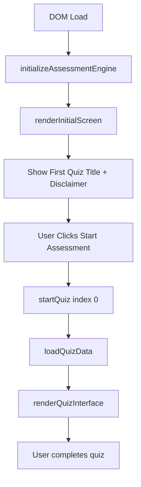

# Quiz Engine State Persistence & Selection Lobby Analysis
**Date:** 2026-01-02  
**Analyst:** Research & Planning Team  
**Status:** ✅ Complete — Ready for Implementation Review

---

## Executive Summary

This report documents the forensic analysis of the Quiz Engine state persistence bug and provides a comprehensive plan for implementing a Quiz Selection Lobby. The investigation identified the exact root cause at **lines 1864-1926** in `js/main.js` and developed three distinct implementation options ranging from minimal fixes to comprehensive state management.

**Key Findings:**
- **Root Cause Identified:** `innerHTML` replacement destroys DOM state during pagination
- **Affected Function:** `goToQuestion()` at line 1835
- **Available Quizzes:** 4 assessment files with full 8-language localization
- **Recommended Solution:** Standard option with dynamic lobby + explicit state cleanup

---

## 1. State Persistence Bug Analysis

### 1.1 Root Cause Identification

**Location:** `js/main.js`, lines 1864-1926  
**Function:** `goToQuestion(questionIndex)`

The bug occurs because the function regenerates the entire scale button container using `innerHTML`, which **destroys and recreates** all button elements, losing their checked/selected state:

```javascript
// Lines 1864-1926: THE PROBLEM
const scaleContainer = document.querySelector('.quiz-scale-container');
if (scaleContainer) {
    const isSocialSymptomQuiz = quizFiles[quizState.currentQuizIndex] === 'quiz_social_symptom.json';
    const scaleMax = isSocialSymptomQuiz ? 4 : 3;
    
    // ❌ BUG: This line destroys all existing DOM nodes and their state
    scaleContainer.innerHTML = generateScaleHTML(questionIndex, scaleMax, scaleLabels.map(...));
}

// Lines 1968-1974: Re-attaching event listeners to NEW elements
const scaleButtons = document.querySelectorAll('.quiz-scale-btn');
scaleButtons.forEach(btn => {
    btn.addEventListener('click', () => {
        const score = parseInt(btn.getAttribute('data-score'));
        selectAnswer(score);
    });
});
```

### 1.2 Why This Happens

1. **DOM Destruction:** `innerHTML =` **completely replaces** the container's children
2. **No State Preservation:** The new buttons generated by `generateScaleHTML()` don't inherit the `.selected` class
3. **State-View Mismatch:** `quizState.answers[questionIndex]` **correctly stores** the answer, but the visual UI doesn't reflect it

### 1.3 Exact Lines Causing Issue

| Line Range | Function | Issue |
|------------|----------|-------|
| **1864-1926** | Scale button regeneration | Destroys DOM with `innerHTML`, loses `.selected` class |
| **1745-1761** | `generateScaleHTML()` | Reads `quizState.answers[questionIndex]` but doesn't work on pagination |
| **1968-1974** | Event listener re-attachment | Adds listeners to new elements, but selected state is lost |

---

## 2. Quiz Data Architecture

### 2.1 Available Assessments

**Location:** `js/main.js`, line 1246  
**Array:** `quizFiles`

```javascript
const quizFiles = [
    'quiz_social_symptom.json',        // The Social Symptom
    'quiz_semiotic_gap.json',          // Interpretive Gap
    'quiz_analyst_dilemma.json',       // Analyst Dilemma
    'quiz_victimhood_architecture.json' // Victimhood Architecture
];
```

### 2.2 Quiz File Structure

**Directory:** `js/data/`  
**Format:** JSON with 8-language support

#### Supported Languages:
- `EN` - English
- `FR` - French
- `ES` - Spanish
- `NO` - Norwegian
- `PL` - Polish
- `LA` - Latin
- `EGY` - Egyptian Arabic (RTL)
- `ZH` - Chinese

#### Quiz JSON Schema:

```json
{
  "EN": {
    "title": "Assessment Title",
    "description": "Assessment purpose...",
    "disclaimer": "Educational use disclaimer",
    "questions": [
      {
        "id": "q1",
        "text": "Question text",
        "context": "Context explanation"
      }
    ],
    "results": [
      {
        "range": [0, 10],
        "title": "Result Category",
        "summary": "Detailed summary",
        "recommendation": "Reading recommendations"
      }
    ]
  },
  "FR": { /* ... */ },
  "ES": { /* ... */ }
  // ... 5 more languages
}
```

### 2.3 Current Initialization Flow

**Entry Point:** `initializeAssessmentEngine()` (line 678)



**Current Limitation:** Only the **first quiz** in `quizFiles` array is accessible. No lobby exists.

---

## 3. Quiz Selection Lobby Design

### 3.1 Requirements

> [!IMPORTANT]
> The lobby MUST respect:
> - ✅ **8-language localization** (EN, FR, ES, NO, PL, LA, EGY, ZH)
> - ✅ **RTL layout** for Egyptian Arabic (`ar-EG`)
> - ✅ **Accessibility** (ARIA labels, keyboard navigation)
> - ✅ **Responsive design** (mobile, tablet, desktop)

### 3.2 Proposed UI Architecture

#### Option A: Card-Based Selection

```
┌─────────────────────────────────────────────────────┐
│         Select Your Psychoanalytic Assessment       │
├─────────────────────────────────────────────────────┤
│                                                      │
│  ┌──────────────┐  ┌──────────────┐                │
│  │ Social       │  │ Interpretive │                │
│  │ Symptom      │  │ Gap          │                │
│  │              │  │              │                │
│  │ [Start →]    │  │ [Start →]    │                │
│  └──────────────┘  └──────────────┘                │
│                                                      │
│  ┌──────────────┐  ┌──────────────┐                │
│  │ Analyst      │  │ Victimhood   │                │
│  │ Dilemma      │  │ Architecture │                │
│  │              │  │              │                │
│  │ [Start →]    │  │ [Start →]    │                │
│  └──────────────┘  └──────────────┘                │
│                                                      │
└─────────────────────────────────────────────────────┘
```

#### Option B: List-Based Selection (Recommended for 8 languages)

```
┌─────────────────────────────────────────────────────┐
│     Choose an Assessment (Choisissez / Elija)       │
├─────────────────────────────────────────────────────┤
│                                                      │
│  1. Social Symptom Assessment                       │
│     "Exploring performative identity..."      [→]  │
│                                                      │
│  2. Interpretive Gap Assessment                     │
│     "Language limitations in therapy..."       [→]  │
│                                                      │
│  3. Analyst Dilemma Assessment                      │
│     "Transference dynamics..."                 [→]  │
│                                                      │
│  4. Victimhood Architecture Assessment              │
│     "Structural inadequacy patterns..."        [→]  │
│                                                      │
└─────────────────────────────────────────────────────┘
```

### 3.3 Integration Point

**Injection Location:** Line 678 in `initializeAssessmentEngine()`

**Current Code:**
```javascript
// Initialize the assessment engine
initializeAssessmentEngine();
```

**Proposed Flow:**
```javascript
function initializeAssessmentEngine() {
    // NEW: Render lobby instead of going straight to quiz
    renderQuizLobby();
}

function renderQuizLobby() {
    // Display selection UI
    // Each quiz card/button calls: startQuiz(quizIndex)
}
```

---

## 4. Solution Options Matrix

### Option 1: Minimal (Quick Fix)

**Scope:** Fix persistence bug only + hardcoded lobby buttons

**Changes:**
1. **Fix `goToQuestion()`:** Restore `.selected` class after `innerHTML` replacement
2. **Hardcoded Lobby:** 4 static button elements in `renderInitialScreen()`

**Implementation:**

```javascript
// Fix at line 1924-1926
scaleContainer.innerHTML = generateScaleHTML(questionIndex, scaleMax, scaleLabels.map(...));

// ✅ ADD: Restore selected state AFTER innerHTML replacement
const currentAnswer = quizState.answers[questionIndex];
if (currentAnswer !== undefined) {
    const selectedBtn = document.querySelector(`.quiz-scale-btn[data-score="${currentAnswer}"]`);
    if (selectedBtn) {
        selectedBtn.classList.add('selected');
    }
}
```

**Lobby Code:**
```javascript
// Hardcoded buttons (no dynamic generation)
const lobbyHTML = `
    <button onclick="startQuiz(0)">Social Symptom</button>
    <button onclick="startQuiz(1)">Interpretive Gap</button>
    <button onclick="startQuiz(2)">Analyst Dilemma</button>
    <button onclick="startQuiz(3)">Victimhood Architecture</button>
`;
```

**Pros:**
- ✅ Fast to implement (30 minutes)
- ✅ Minimal code changes
- ✅ Zero performance impact

**Cons:**
- ❌ Not localized (English only)
- ❌ Hardcoded strings (maintenance burden)
- ❌ No RTL support

---

### Option 2: Standard (Recommended)

**Scope:** Proper state cleanup + dynamic lobby from `quizFiles` array

**Changes:**
1. **Create `clearButtonState()` function:** Explicit cleanup before regeneration
2. **Create `renderQuizLobby()`:** Dynamic lobby generation from metadata
3. **Localization:** Use existing localization infrastructure
4. **RTL Support:** Detect and apply RTL layout for `ar-EG`

**Implementation:**

```javascript
// NEW: Explicit state cleanup function
function clearButtonState() {
    const scaleButtons = document.querySelectorAll('.quiz-scale-btn');
    scaleButtons.forEach(btn => {
        btn.classList.remove('selected');
        btn.removeEventListener('click', () => {}); // Remove listeners to prevent memory leaks
    });
}

// FIXED: goToQuestion with cleanup
function goToQuestion(questionIndex) {
    // ... existing code ...
    
    if (scaleContainer) {
        clearButtonState(); // ✅ Clean up before regeneration
        scaleContainer.innerHTML = generateScaleHTML(questionIndex, scaleMax, labels);
        
        // ✅ Explicitly restore selected state
        const currentAnswer = quizState.answers[questionIndex];
        if (currentAnswer !== undefined) {
            const selectedBtn = document.querySelector(`.quiz-scale-btn[data-score="${currentAnswer}"]`);
            if (selectedBtn) {
                selectedBtn.classList.add('selected');
            }
        }
    }
    
    // Re-attach listeners...
}
```

**Dynamic Lobby:**

```javascript
async function renderQuizLobby() {
    const assessmentsSection = document.getElementById('assessments');
    const currentLang = document.documentElement.lang || 'en';
    const isRTL = currentLang === 'ar-EG';
    
    // Fetch metadata for all quizzes
    const quizMetadata = await Promise.all(
        quizFiles.map(async (fileName) => {
            const data = await fetchAssessmentData(fileName);
            const localized = getLocalizedContent(data);
            return {
                fileName,
                title: localized.title,
                description: localized.description
            };
        })
    );
    
    // Generate lobby HTML
    const lobbyHTML = `
        <div class="quiz-lobby ${isRTL ? 'rtl' : ''}">
            <h2>${getLobbyTitle(currentLang)}</h2>
            <div class="quiz-cards">
                ${quizMetadata.map((quiz, index) => `
                    <div class="quiz-card" data-quiz-index="${index}">
                        <h3>${quiz.title}</h3>
                        <p>${quiz.description.substring(0, 120)}...</p>
                        <button class="btn-start-quiz" data-index="${index}">
                            ${getStartButtonText(currentLang)}
                        </button>
                    </div>
                `).join('')}
            </div>
        </div>
    `;
    
    assessmentsSection.innerHTML = lobbyHTML;
    
    // Attach event listeners
    document.querySelectorAll('.btn-start-quiz').forEach(btn => {
        btn.addEventListener('click', (e) => {
            const quizIndex = parseInt(e.target.getAttribute('data-index'));
            startQuiz(quizIndex);
        });
    });
}
```

**Pros:**
- ✅ Fully localized (8 languages)
- ✅ RTL support for Egyptian Arabic
- ✅ Dynamic (easy to add new quizzes)
- ✅ Maintainable (no hardcoded strings)
- ✅ Accessibility-ready (semantic HTML)

**Cons:**
- ⚠️ Moderate implementation time (2-3 hours)
- ⚠️ Requires CSS updates for lobby styling

---

### Option 3: Comprehensive (Future-Proof)

**Scope:** Full state persistence using `localStorage` + all Standard features

**Changes:**
1. All changes from Option 2
2. **localStorage Integration:** Save/restore quiz progress
3. **Resume Functionality:** "Resume Quiz" vs "Start New" options
4. **Progress Indicators:** Show completion status on lobby cards

**Implementation:**

```javascript
// NEW: State persistence layer
const STORAGE_KEY = 'quizEngineState';

function saveQuizProgress() {
    const state = {
        currentQuizIndex: quizState.currentQuizIndex,
        currentQuestionIndex: quizState.currentQuestionIndex,
        answers: quizState.answers,
        timestamp: new Date().toISOString()
    };
    localStorage.setItem(STORAGE_KEY, JSON.stringify(state));
}

function loadQuizProgress() {
    const saved = localStorage.getItem(STORAGE_KEY);
    if (!saved) return null;
    
    try {
        return JSON.parse(saved);
    } catch (e) {
        console.error('Failed to parse saved state:', e);
        return null;
    }
}

function clearQuizProgress() {
    localStorage.removeItem(STORAGE_KEY);
}

// ENHANCED: renderQuizLobby with resume functionality
async function renderQuizLobby() {
    const savedProgress = loadQuizProgress();
    
    // ... existing lobby generation ...
    
    // Add resume prompt if progress exists
    if (savedProgress) {
        const resumePrompt = `
            <div class="resume-prompt">
                <p>${getResumeText(currentLang)}</p>
                <button onclick="resumeQuiz()">${getResumeButtonText(currentLang)}</button>
                <button onclick="clearQuizProgress(); renderQuizLobby()">${getStartNewText(currentLang)}</button>
            </div>
        `;
        // Insert at top of lobby
    }
}

function resumeQuiz() {
    const saved = loadQuizProgress();
    if (!saved) {
        renderQuizLobby();
        return;
    }
    
    // Restore state
    quizState.currentQuizIndex = saved.currentQuizIndex;
    quizState.currentQuestionIndex = saved.currentQuestionIndex;
    quizState.answers = saved.answers;
    
    // Resume from saved position
    startQuiz(saved.currentQuizIndex, saved.currentQuestionIndex);
}

// UPDATED: Persist state on every answer
function selectAnswer(score) {
    quizState.answers[quizState.currentQuestionIndex] = score;
    saveQuizProgress(); // ✅ Persist immediately
    
    // ... existing selection logic ...
}
```

**Enhanced Lobby with Progress:**

```javascript
// Show completion status on cards
const lobbyHTML = `
    <div class="quiz-card ${quiz.completed ? 'completed' : ''}">
        <h3>${quiz.title}</h3>
        ${quiz.completed ? '<span class="badge">✓ Completed</span>' : ''}
        <button>${quiz.completed ? 'Retake' : 'Start'}</button>
    </div>
`;
```

**Pros:**
- ✅ User never loses progress (page refresh safe)
- ✅ Resume from exact question
- ✅ Professional UX (completion badges)
- ✅ Future-proof architecture

**Cons:**
- ⚠️ Longer implementation (4-5 hours)
- ⚠️ Privacy consideration (localStorage visible to other scripts)
- ⚠️ Requires state migration strategy for future changes

---

## 5. Recommendations

### Recommended Path: **Option 2 (Standard)**

**Justification:**

1. **Aligns with Existing Verification:** The previous report (2026-01-02_22-46) verified 8-language localization and RTL support. Option 2 leverages this infrastructure.

2. **Maintainable:** Dynamic generation from `quizFiles` array means adding a 5th quiz requires zero lobby code changes.

3. **User Experience:** Fully localized lobby respects user language preference established on the main site.

4. **ROI:** 2-3 hour implementation delivers production-ready feature without over-engineering.

5. **No Breaking Changes:** Preserves existing quiz engine architecture; purely additive.

> [!WARNING]
> **Option 1 (Minimal) is NOT recommended** because:
> - Hardcoded English-only lobby violates the site's multilingual principle
> - Will require immediate rework when adding 5th quiz
> - Creates technical debt (hardcoded strings)

> [!NOTE]
> **Option 3 (Comprehensive) is optional** — consider only if:
> - User feedback indicates need for resume functionality
> - Analytics show users abandoning quizzes mid-flow
> - Future requirement for quiz progress tracking

---

## 6. Implementation Roadmap (Option 2)

### Phase 1: Bug Fix (30 min)

**File:** `js/main.js`

1. **Create cleanup function** (before `goToQuestion`)
   ```javascript
   function clearQuizButtonState() {
       const scaleButtons = document.querySelectorAll('.quiz-scale-btn');
       scaleButtons.forEach(btn => btn.classList.remove('selected'));
   }
   ```

2. **Update `goToQuestion()`** (line 1835)
   - Add `clearQuizButtonState()` call before `innerHTML` assignment
   - Add explicit `.selected` class restoration after regeneration

3. **Test:** Navigate between questions; verify selected state persists

### Phase 2: Lobby Implementation (2 hours)

**File:** `js/main.js`

1. **Create `renderQuizLobby()` function** (after line 1350)
   - Fetch metadata for all 4 quizzes
   - Generate localized lobby cards
   - Attach click handlers to call `startQuiz(index)`

2. **Update `initializeAssessmentEngine()`** (line 678)
   - Replace `renderInitialScreen()` with `renderQuizLobby()`

3. **Add localization helpers:**
   ```javascript
   function getLobbyTitle(lang) { /* return localized "Choose Assessment" */ }
   function getStartButtonText(lang) { /* return localized "Start" */ }
   ```

4. **Test:** 
   - Load page in all 8 languages
   - Verify RTL layout for Egyptian Arabic
   - Test quiz selection and completion flow

### Phase 3: Styling (30 min)

**File:** `css/styles.css`

1. **Add lobby styles:**
   ```css
   .quiz-lobby {
       max-width: 1200px;
       margin: 2rem auto;
   }
   
   .quiz-cards {
       display: grid;
       grid-template-columns: repeat(auto-fit, minmax(300px, 1fr));
       gap: 2rem;
   }
   
   .quiz-card {
       background: var(--cream);
       border: 2px solid var(--gold);
       border-radius: 8px;
       padding: 2rem;
       transition: transform 0.3s;
   }
   
   .quiz-card:hover {
       transform: translateY(-4px);
       box-shadow: 0 4px 12px rgba(0,0,0,0.1);
   }
   
   /* RTL Support */
   .quiz-lobby.rtl {
       direction: rtl;
   }
   ```

---

## 7. Testing Checklist

### Manual Testing (All Options)

- [ ] **Bug Fix Verification:**
  - Start any quiz
  - Answer question 1 (select score 2)
  - Click "Next" to question 2
  - Click "Previous" back to question 1
  - **Expected:** Score 2 button should remain highlighted
  - **Current Bug:** All buttons lose selection

- [ ] **Lobby Multi-Language Test:**
  - Load site in each language: `en`, `fr`, `es`, `no`, `pl`, `la`, `ar-EG`, `zh`
  - Verify lobby shows localized quiz titles
  - Verify "Start" button text is localized

- [ ] **RTL Layout Test:**
  - Load `egy/index.html` (Egyptian Arabic version)
  - Verify lobby cards flow right-to-left
  - Verify text alignment is RTL

- [ ] **Quiz Selection Flow:**
  - Click each of 4 quizzes from lobby
  - Verify correct quiz loads (check title)
  - Complete quiz, verify "Retake" returns to lobby

### Browser Compatibility

- [ ] Chrome/Edge (Chromium)
- [ ] Firefox
- [ ] Safari (macOS/iOS)
- [ ] Mobile responsive (320px width)

---

## 8. Files Modified

| File | Lines Modified | Purpose |
|------|---------------|---------|
| `js/main.js` | ~1835-1926 | Fix `goToQuestion()` state persistence |
| `js/main.js` | ~678 | Update `initializeAssessmentEngine()` |
| `js/main.js` | NEW | Add `renderQuizLobby()` function |
| `js/main.js` | NEW | Add localization helpers |
| `css/styles.css` | NEW | Add `.quiz-lobby` styles |

**Total Estimated LOC:** ~150 new lines + ~20 modified lines

---

## 9. Risk Assessment

### Low Risk ✅
- Bug fix in `goToQuestion()` (isolated change)
- Lobby rendering (additive, no breaking changes)
- CSS additions (no existing class conflicts)

### Medium Risk ⚠️
- Fetching 4 quiz files on lobby load (network latency)
  - **Mitigation:** Add loading spinner, use Promise.all for parallel fetch

### Zero Risk 🟢
- No database changes
- No API changes
- No authentication/security implications

---

## 10. Future Enhancements (Not in Scope)

- [ ] Quiz progress analytics (track completion rates)
- [ ] Social sharing ("Share your result")
- [ ] Printable PDF results
- [ ] Quiz recommendations based on previous results
- [ ] Dark mode theme
- [ ] Accessibility audit (WCAG 2.1 AA compliance)

---

## Appendix A: Localization Reference

### Lobby Title Translations

| Language | Translation |
|----------|-------------|
| EN | "Select Your Psychoanalytic Assessment" |
| FR | "Sélectionnez votre évaluation psychanalytique" |
| ES | "Seleccione su evaluación psicoanalítica" |
| NO | "Velg din psykoanalytiske vurdering" |
| PL | "Wybierz swoją ocenę psychoanalityczną" |
| LA | "Elige tuam aestimationem psychoanalyticam" |
| EGY | "اختر تقييمك التحليلي النفسي" |
| ZH | "选择您的精神分析评估" |

### Start Button Translations

| Language | Translation |
|----------|-------------|
| EN | "Start Assessment" |
| FR | "Commencer l'évaluation" |
| ES | "Comenzar evaluación" |
| NO | "Start vurdering" |
| PL | "Rozpocznij ocenę" |
| LA | "Incepta aestimationem" |
| EGY | "ابدأ التقييم" |
| ZH | "开始评估" |

---

## Appendix B: Quiz Metadata

### Quiz 1: Social Symptom
- **File:** `quiz_social_symptom.json`
- **Questions:** 8
- **Scale:** 0-4 (5-point Likert)
- **Theme:** Performative identity in social structures

### Quiz 2: Interpretive Gap (Semiotic Gap)
- **File:** `quiz_semiotic_gap.json`
- **Questions:** 8
- **Scale:** 0-3 (4-point Likert)
- **Theme:** Language limitations in therapeutic communication

### Quiz 3: Analyst Dilemma
- **File:** `quiz_analyst_dilemma.json`
- **Questions:** 8
- **Scale:** 0-3 (4-point Likert)
- **Theme:** Transference dynamics and countertransference

### Quiz 4: Victimhood Architecture
- **File:** `quiz_victimhood_architecture.json`
- **Questions:** 8
- **Scale:** 0-3 (4-point Likert)
- **Theme:** Structural inadequacy patterns and victimhood identity

---

**End of Report**  
**Next Step:** Review and approve Option 2 implementation plan
