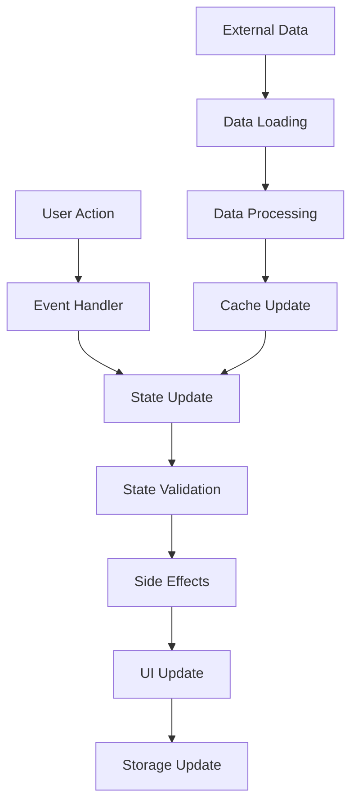

# Contextual Quote Journey JavaScript Implementation Plan

## Overview

This document outlines the complete JavaScript architecture for the Contextual Quote Journey system that will replace the existing QuoteCarousel class in main.js. The implementation will create an interactive network-based navigation experience embodying the "Labyrinth of Interpretation" concept.

## 1. Core Class Architecture

### QuoteJourney Class

The main class that orchestrates the entire Contextual Quote Journey system:

```javascript
class QuoteJourney {
  constructor(options = {}) {
    // Configuration
    this.config = {
      dataUrl: options.dataUrl || 'data/quotes.json',
      containerSelector: options.containerSelector || '#quote-journey-container',
      networkContainerSelector: options.networkContainerSelector || '#network-visualization',
      saveToLocalStorage: options.saveToLocalStorage !== false,
      animationDuration: options.animationDuration || 300,
      maxJourneyLength: options.maxJourneyLength || 10,
      ...options
    };
    
    // State management
    this.state = {
      quotes: [],                    // All quote data
      themes: [],                    // Theme data
      connections: [],                // Connection data
      currentQuoteId: null,          // Currently active quote
      journeyHistory: [],             // User's navigation history
      journeyFuture: [],              // Forward navigation stack
      visitedQuotes: new Set(),       // Track visited quotes
      activeThemeFilter: 'all',       // Current theme filter
      networkVisible: false,          // Network visualization state
      breadcrumbs: [],                // Breadcrumb navigation data
      relatedQuotesVisible: false      // Related quotes section state
    };
    
    // Cache for performance
    this.cache = {
      quoteMap: new Map(),           // Fast quote lookup by ID
      connectionMap: new Map(),       // Fast connection lookup
      themeMap: new Map(),           // Fast theme lookup
      pathCache: new Map(),          // Cached path calculations
      renderedQuotes: new Set()       // Track already rendered quotes
    };
    
    // DOM element references
    this.elements = {};
    
    // Network visualization
    this.network = null;
    
    // Event listeners registry
    this.listeners = new Map();
    
    // Initialization flag
    this.initialized = false;
  }
}
```

### Helper Classes

#### JourneyTracker Class

```javascript
class JourneyTracker {
  constructor(maxLength = 10) {
    this.history = [];
    this.currentIndex = -1;
    this.maxLength = maxLength;
    this.visitedQuotes = new Set();
  }
  
  // Navigation methods
  navigateTo(quoteId, connectionType) { /* ... */ }
  goBack() { /* ... */ }
  goForward() { /* ... */ }
  canGoBack() { /* ... */ }
  canGoForward() { /* ... */ }
  
  // Journey analysis
  getCurrentPath() { /* ... */ }
  getJourneyInsights() { /* ... */ }
  getExploredThemes() { /* ... */ }
  calculateThematicDiversity() { /* ... */ }
  
  // Persistence
  save() { /* ... */ }
  load(savedData) { /* ... */ }
  reset() { /* ... */ }
}
```

#### NetworkVisualization Class (D3.js)

```javascript
class NetworkVisualization {
  constructor(container, options = {}) {
    this.container = container;
    this.options = {
      width: options.width || 800,
      height: options.height || 600,
      nodeRadius: options.nodeRadius || 8,
      linkDistance: options.linkDistance || 100,
      chargeStrength: options.chargeStrength || -300,
      ...options
    };
    
    this.simulation = null;
    this.svg = null;
    this.nodes = [];
    this.links = [];
    this.selectedNode = null;
    this.hoveredNode = null;
  }
  
  // Core methods
  initialize() { /* ... */ }
  updateData(quotes, connections, currentQuoteId) { /* ... */ }
  highlightPath(quoteIds) { /* ... */ }
  centerOnNode(quoteId) { /* ... */ }
  
  // Interaction handlers
  handleNodeClick(node) { /* ... */ }
  handleNodeHover(node) { /* ... */ }
  handleLinkClick(link) { /* ... */ }
  
  // Rendering
  render() { /* ... */ }
  updateNodePositions() { /* ... */ }
  animateTransition(newData) { /* ... */ }
  
  // Utility methods
  zoomIn() { /* ... */ }
  zoomOut() { /* ... */ }
  resetView() { /* ... */ }
  destroy() { /* ... */ }
}
```

## 2. State Management Approach and Data Flow

### State Structure

```javascript
const initialState = {
  // Data state
  quotes: [],                    // Array of quote objects
  themes: [],                    // Array of theme objects
  connections: [],                // Array of connection objects
  
  // Navigation state
  currentQuoteId: null,          // Currently active quote ID
  journeyHistory: [],             // Array of quote IDs in navigation order
  journeyFuture: [],              // Stack for forward navigation
  visitedQuotes: new Set(),       // Set of visited quote IDs
  
  // UI state
  activeThemeFilter: 'all',       // Currently selected theme filter
  networkVisible: false,          // Network visualization visibility
  breadcrumbs: [],                // Breadcrumb navigation data
  relatedQuotesVisible: false,     // Related quotes section visibility
  
  // User preferences
  preferences: {
    animationSpeed: 'normal',      // 'slow', 'normal', 'fast'
    showNetworkOnLoad: false,     // Whether to show network on initial load
    autoSaveJourney: true,        // Whether to auto-save journey progress
    preferredDifficulty: 'all'      // 'beginner', 'intermediate', 'advanced', 'all'
  }
};
```

### Data Flow Pattern



### State Management Methods

```javascript
// State mutation methods
updateState(updates) {
  // Validate state updates
  const validatedUpdates = this.validateStateUpdates(updates);
  
  // Apply updates
  const previousState = { ...this.state };
  this.state = { ...this.state, ...validatedUpdates };
  
  // Trigger side effects
  this.handleStateChanges(previousState, this.state);
  
  // Save to localStorage if needed
  if (this.config.saveToLocalStorage) {
    this.saveStateToStorage();
  }
}

// Specific state update methods
setCurrentQuote(quoteId, connectionType) {
  const quote = this.cache.quoteMap.get(quoteId);
  if (!quote) return false;
  
  this.updateState({
    currentQuoteId: quoteId,
    journeyHistory: [...this.state.journeyHistory, { quoteId, connectionType }],
    journeyFuture: [], // Clear forward stack
    visitedQuotes: new Set([...this.state.visitedQuotes, quoteId]),
    breadcrumbs: this.generateBreadcrumbs([...this.state.journeyHistory, { quoteId, connectionType }])
  });
  
  return true;
}

setThemeFilter(themeId) {
  this.updateState({
    activeThemeFilter: themeId,
    currentQuoteId: null, // Reset current quote when filtering
    relatedQuotesVisible: false
  });
}
```

## 3. Event Handling Strategy

### Event Delegation Pattern

```javascript
setupEventListeners() {
  const container = document.querySelector(this.config.containerSelector);
  
  // Use event delegation for dynamic content
  container.addEventListener('click', this.handleClick.bind(this));
  container.addEventListener('keydown', this.handleKeydown.bind(this));
  container.addEventListener('focusin', this.handleFocus.bind(this));
  
  // Window events
  window.addEventListener('resize', this.handleResize.bind(this));
  window.addEventListener('beforeunload', this.handleBeforeUnload.bind(this));
  
  // Custom event listeners
  this.addEventListener('quote:navigate', this.handleQuoteNavigation.bind(this));
  this.addEventListener('theme:change', this.handleThemeChange.bind(this));
  this.addEventListener('network:toggle', this.handleNetworkToggle.bind(this));
}
```

### Event Handler Methods

```javascript
handleClick(event) {
  const { target } = event;
  
  // Handle different click targets
  if (target.matches('.btn-explore-further')) {
    this.handleExploreFurther(event);
  } else if (target.matches('.btn-navigate-to-quote')) {
    this.handleQuoteNavigation(event);
  } else if (target.matches('.theme-filter-btn')) {
    this.handleThemeFilter(event);
  } else if (target.matches('.breadcrumb-link')) {
    this.handleBreadcrumbNavigation(event);
  } else if (target.matches('.btn-nav-back')) {
    this.handleBackNavigation(event);
  } else if (target.matches('.btn-nav-forward')) {
    this.handleForwardNavigation(event);
  } else if (target.matches('.btn-toggle-network')) {
    this.handleNetworkToggle(event);
  } else if (target.matches('.btn-reset-journey')) {
    this.handleJourneyReset(event);
  }
}

handleKeydown(event) {
  const { key, ctrlKey, metaKey } = event;
  
  // Keyboard shortcuts
  if (key === 'Escape') {
    this.handleEscapeKey(event);
  } else if (key === 'ArrowLeft' && !ctrlKey && !metaKey) {
    this.handleBackNavigation(event);
  } else if (key === 'ArrowRight' && !ctrlKey && !metaKey) {
    this.handleForwardNavigation(event);
  } else if ((ctrlKey || metaKey) && key === 'z') {
    this.handleUndo(event);
  }
}
```

### Custom Event System

```javascript
// Event registration
addEventListener(eventName, callback, options = {}) {
  if (!this.listeners.has(eventName)) {
    this.listeners.set(eventName, []);
  }
  
  this.listeners.get(eventName).push({
    callback,
    once: options.once || false,
    context: options.context || this
  });
}

// Event dispatching
dispatchEvent(eventName, data = {}) {
  if (!this.listeners.has(eventName)) return;
  
  const listeners = this.listeners.get(eventName);
  const event = {
    name: eventName,
    data,
    timestamp: Date.now(),
    preventDefault: false,
    stopPropagation: false
  };
  
  // Execute listeners
  for (let i = listeners.length - 1; i >= 0; i--) {
    const listener = listeners[i];
    listener.callback.call(listener.context, event);
    
    if (listener.once) {
      listeners.splice(i, 1);
    }
    
    if (event.stopPropagation) break;
  }
}
```

## 4. Network Visualization Rendering Approach (D3.js)

### D3.js Force-Directed Graph Implementation

```javascript
initializeNetwork() {
  // Create SVG container
  this.svg = d3.select(this.container)
    .append('svg')
    .attr('width', this.options.width)
    .attr('height', this.options.height);
  
  // Create zoom behavior
  const zoom = d3.zoom()
    .scaleExtent([0.1, 4])
    .on('zoom', (event) => {
      this.g.attr('transform', event.transform);
    });
  
  this.svg.call(zoom);
  
  // Create main group
  this.g = this.svg.append('g');
  
  // Create force simulation
  this.simulation = d3.forceSimulation()
    .force('link', d3.forceLink().id(d => d.id).distance(this.options.linkDistance))
    .force('charge', d3.forceManyBody().strength(this.options.chargeStrength))
    .force('center', d3.forceCenter(this.options.width / 2, this.options.height / 2))
    .force('collision', d3.forceCollide().radius(d => d.radius * 2));
}

updateNetworkData(quotes, connections, currentQuoteId) {
  // Transform data for D3
  this.nodes = quotes.map(quote => ({
    id: quote.id,
    title: quote.title,
    themes: quote.themes,
    x: quote.position.x * this.options.width,
    y: quote.position.y * this.options.height,
    radius: quote.visual.size * this.options.nodeRadius,
    color: quote.visual.color,
    type: quote.visual.type,
    isCurrent: quote.id === currentQuoteId,
    isVisited: this.visitedQuotes.has(quote.id)
  }));
  
  this.links = connections.map(conn => ({
    source: conn.from,
    target: conn.to,
    type: conn.type,
    strength: conn.strength,
    color: conn.visual.color,
    width: conn.visual.width,
    style: conn.visual.style
  }));
  
  this.render();
}

render() {
  // Clear existing elements
  this.g.selectAll('*').remove();
  
  // Create links
  const link = this.g.append('g')
    .selectAll('line')
    .data(this.links)
    .enter().append('line')
    .attr('stroke', d => d.color)
    .attr('stroke-width', d => d.width)
    .attr('stroke-dasharray', d => d.style === 'dashed' ? '5,5' : 
                           d.style === 'dotted' ? '2,2' : '0')
    .attr('class', d => `network-link link-${d.type}`)
    .on('click', (event, d) => this.handleLinkClick(d));
  
  // Create nodes
  const node = this.g.append('g')
    .selectAll('circle')
    .data(this.nodes)
    .enter().append('circle')
    .attr('r', d => d.radius)
    .attr('fill', d => d.color)
    .attr('class', d => `network-node node-${d.type} ${d.isCurrent ? 'current' : ''} ${d.isVisited ? 'visited' : ''}`)
    .on('click', (event, d) => this.handleNodeClick(d))
    .on('mouseover', (event, d) => this.handleNodeHover(d))
    .on('mouseout', (event, d) => this.handleNodeLeave(d))
    .call(this.drag());
  
  // Add labels
  const label = this.g.append('g')
    .selectAll('text')
    .data(this.nodes)
    .enter().append('text')
    .text(d => d.title)
    .attr('class', 'network-label')
    .attr('text-anchor', 'middle')
    .attr('dy', d => d.radius + 15);
  
  // Update simulation
  this.simulation.nodes(this.nodes);
  this.simulation.force('link').links(this.links);
  this.simulation.on('tick', () => {
    link
      .attr('x1', d => d.source.x)
      .attr('y1', d => d.source.y)
      .attr('x2', d => d.target.x)
      .attr('y2', d => d.target.y);
    
    node
      .attr('cx', d => d.x)
      .attr('cy', d => d.y);
    
    label
      .attr('x', d => d.x)
      .attr('y', d => d.y);
  });
  
  this.simulation.alpha(1).restart();
}
```

### Network Interaction Methods

```javascript
handleNodeClick(node) {
  // Navigate to the selected quote
  this.dispatchEvent('quote:navigate', { quoteId: node.id });
  
  // Highlight the path to this node
  this.highlightPath(this.getPathToNode(node.id));
}

handleNodeHover(node) {
  // Show tooltip with quote preview
  this.showTooltip(node, event);
  
  // Highlight connected nodes
  this.highlightConnectedNodes(node);
}

handleLinkClick(link) {
  // Show relationship details
  this.showRelationshipDetails(link);
  
  // Navigate to target quote
  this.dispatchEvent('quote:navigate', { 
    quoteId: link.target.id,
    connectionType: link.type 
  });
}

highlightPath(quoteIds) {
  // Highlight nodes and links in the path
  this.g.selectAll('.network-node')
    .classed('highlighted', d => quoteIds.includes(d.id));
  
  this.g.selectAll('.network-link')
    .classed('highlighted', d => 
      quoteIds.includes(d.source.id) && quoteIds.includes(d.target.id)
    );
}
```

## 5. Integration Points with Existing Code

### Replacing QuoteCarousel in main.js

```javascript
// In main.js, replace the existing QuoteCarousel initialization:
document.addEventListener('DOMContentLoaded', function() {
  // Remove existing QuoteCarousel initialization
  // const carousel = new QuoteCarousel();
  
  // Initialize new Contextual Quote Journey system
  const quoteJourney = new QuoteJourney({
    dataUrl: 'data/quotes.json',
    containerSelector: '#quote-journey-container',
    saveToLocalStorage: true,
    animationDuration: 300
  });
  
  // Initialize the system
  quoteJourney.initialize().then(() => {
    console.log('Contextual Quote Journey initialized successfully');
  }).catch(error => {
    console.error('Failed to initialize Quote Journey:', error);
  });
  
  // Keep existing newsletter form initialization
  // carousel.setupNewsletterForm();
  // Replace with direct call since carousel is removed
  initializeNewsletterForm();
});
```

### CSS Integration

```javascript
// Add CSS classes dynamically as needed
updateQuoteDisplay(quote) {
  const quoteElement = this.elements.activeQuote;
  
  // Update content
  quoteElement.querySelector('.quote-title').textContent = quote.title;
  quoteElement.querySelector('.quote-text').textContent = `"${quote.quote}"`;
  quoteElement.querySelector('.context-text').textContent = quote.context;
  
  // Update theme badges
  const themeContainer = quoteElement.querySelector('.quote-themes');
  themeContainer.innerHTML = '';
  quote.themes.forEach(themeId => {
    const theme = this.cache.themeMap.get(themeId);
    const badge = document.createElement('span');
    badge.className = `theme-badge theme-${themeId}`;
    badge.textContent = theme.name;
    badge.style.backgroundColor = theme.color;
    themeContainer.appendChild(badge);
  });
  
  // Update difficulty indicator
  const difficultyElement = quoteElement.querySelector('.quote-difficulty');
  difficultyElement.textContent = quote.metadata.difficulty;
  difficultyElement.className = `quote-difficulty difficulty-${quote.metadata.difficulty}`;
  
  // Update source citation
  const sourceElement = quoteElement.querySelector('.source-citation');
  sourceElement.innerHTML = `${quote.source.work}, ${quote.source.year}`;
  
  // Trigger animation
  quoteElement.classList.add('quote-updating');
  setTimeout(() => {
    quoteElement.classList.remove('quote-updating');
  }, this.config.animationDuration);
}
```

### Navigation Integration

```javascript
// Integrate with existing smooth scrolling
setupSmoothScrolling() {
  document.querySelectorAll('a[href^="#"]').forEach(anchor => {
    anchor.addEventListener('click', function (e) {
      e.preventDefault();
      const target = document.querySelector(this.getAttribute('href'));
      if (target) {
        target.scrollIntoView({
          behavior: 'smooth',
          block: 'start'
        });
        
        // If navigating to insights section, ensure journey is properly initialized
        if (this.getAttribute('href') === '#insights') {
          this.quoteJourney.ensureVisible();
        }
      }
    });
  });
}
```

## 6. Error Handling and Edge Cases

### Error Handling Strategy

```javascript
class QuoteJourneyErrorHandler {
  constructor(quoteJourney) {
    this.quoteJourney = quoteJourney;
    this.errorCount = 0;
    this.maxErrors = 5;
  }
  
  // Handle different types of errors
  handleDataLoadError(error) {
    console.error('Failed to load quote data:', error);
    this.showError('Unable to load quotes. Please refresh the page.');
    
    // Fallback to sample data if available
    this.loadFallbackData();
  }
  
  handleNetworkError(error) {
    console.error('Network visualization error:', error);
    this.showError('Network visualization unavailable. Text navigation still works.');
    
    // Disable network features
    this.quoteJourney.disableNetworkFeatures();
  }
  
  handleNavigationError(quoteId, error) {
    console.error(`Navigation error for quote ${quoteId}:`, error);
    this.showError('Unable to navigate to selected quote.');
    
    // Reset to last valid state
    this.quoteJourney.resetToLastValidState();
  }
  
  handleStorageError(error) {
    console.error('Local storage error:', error);
    this.quoteJourney.config.saveToLocalStorage = false;
  }
  
  // Error display methods
  showError(message) {
    const errorElement = document.createElement('div');
    errorElement.className = 'journey-error';
    errorElement.textContent = message;
    
    const container = document.querySelector(this.quoteJourney.config.containerSelector);
    container.appendChild(errorElement);
    
    // Auto-remove after 5 seconds
    setTimeout(() => {
      if (errorElement.parentNode) {
        errorElement.parentNode.removeChild(errorElement);
      }
    }, 5000);
  }
  
  // Fallback mechanisms
  loadFallbackData() {
    // Use embedded sample data if external load fails
    if (typeof sampleQuoteData !== 'undefined') {
      this.quoteJourney.loadData(sampleQuoteData);
    }
  }
}
```

### Edge Case Handling

```javascript
// Handle missing or invalid quote data
validateQuoteData(quote) {
  const requiredFields = ['id', 'title', 'quote', 'context', 'themes', 'relatedQuotes'];
  const missingFields = requiredFields.filter(field => !quote[field]);
  
  if (missingFields.length > 0) {
    console.warn(`Quote ${quote.id} missing required fields:`, missingFields);
    return false;
  }
  
  // Validate related quotes exist
  const invalidRelatedQuotes = quote.relatedQuotes.filter(
    related => !this.cache.quoteMap.has(related.id)
  );
  
  if (invalidRelatedQuotes.length > 0) {
    console.warn(`Quote ${quote.id} has invalid related quotes:`, invalidRelatedQuotes);
    // Remove invalid references
    quote.relatedQuotes = quote.relatedQuotes.filter(
      related => this.cache.quoteMap.has(related.id)
    );
  }
  
  return true;
}

// Handle circular references in journey
detectCircularReference(quoteId) {
  if (this.state.journeyHistory.length === 0) return false;
  
  const recentQuotes = this.state.journeyHistory.slice(-5).map(item => item.quoteId);
  return recentQuotes.includes(quoteId);
}

// Handle maximum journey length
enforceMaxJourneyLength() {
  if (this.state.journeyHistory.length >= this.config.maxJourneyLength) {
    // Show warning
    this.showWarning('Maximum journey length reached. Consider starting a new journey.');
    
    // Disable further navigation
    this.disableFurtherNavigation();
  }
}

// Handle browser compatibility issues
checkBrowserCompatibility() {
  const requiredFeatures = [
    'localStorage',
    'addEventListener',
    'querySelector',
    'classList'
  ];
  
  const missingFeatures = requiredFeatures.filter(
    feature => !(feature in window || feature in document)
  );
  
  if (missingFeatures.length > 0) {
    this.showError(`Your browser may not support all features. Missing: ${missingFeatures.join(', ')}`);
    this.enableCompatibilityMode();
  }
}
```

## 7. Performance Optimization Strategies

### Data Loading Optimization

```javascript
// Lazy loading implementation
class LazyDataLoader {
  constructor(quoteJourney) {
    this.quoteJourney = quoteJourney;
    this.loadedQuotes = new Set();
    this.loadingPromises = new Map();
  }
  
  // Load quote data on demand
  async loadQuoteDetails(quoteId) {
    if (this.loadedQuotes.has(quoteId)) {
      return this.quoteJourney.cache.quoteMap.get(quoteId);
    }
    
    if (this.loadingPromises.has(quoteId)) {
      return this.loadingPromises.get(quoteId);
    }
    
    const promise = this.fetchQuoteDetails(quoteId);
    this.loadingPromises.set(quoteId, promise);
    
    try {
      const quote = await promise;
      this.loadedQuotes.add(quoteId);
      this.quoteJourney.cache.quoteMap.set(quoteId, quote);
      return quote;
    } finally {
      this.loadingPromises.delete(quoteId);
    }
  }
  
  // Batch load related quotes
  async preloadRelatedQuotes(quoteId, maxPreload = 3) {
    const quote = await this.loadQuoteDetails(quoteId);
    const relatedQuotes = quote.relatedQuotes.slice(0, maxPreload);
    
    // Preload in parallel
    const preloadPromises = relatedQuotes.map(related => 
      this.loadQuoteDetails(related.id)
    );
    
    await Promise.allSettled(preloadPromises);
  }
}
```

### Network Rendering Optimization

```javascript
// Optimize network visualization for large datasets
class OptimizedNetworkRenderer {
  constructor() {
    this.renderQueue = [];
    this.isRendering = false;
    this.frameId = null;
  }
  
  // Throttled rendering
  scheduleRender() {
    if (this.isRendering) return;
    
    this.isRendering = true;
    this.frameId = requestAnimationFrame(() => {
      this.processRenderQueue();
      this.isRendering = false;
    });
  }
  
  processRenderQueue() {
    // Process only visible nodes
    const visibleNodes = this.getVisibleNodes();
    const visibleLinks = this.getVisibleLinks();
    
    // Update only changed elements
    this.updateNodes(visibleNodes);
    this.updateLinks(visibleLinks);
  }
  
  // Level of detail based on zoom
  getVisibleNodes() {
    const zoomLevel = this.getCurrentZoomLevel();
    
    if (zoomLevel < 0.5) {
      // Show only important nodes at far zoom
      return this.nodes.filter(node => 
        node.type === 'central' || node.type === 'gateway'
      );
    } else if (zoomLevel < 1.0) {
      // Show main nodes at medium zoom
      return this.nodes.filter(node => 
        node.type !== 'standard' || node.isCurrent || node.isVisited
      );
    } else {
      // Show all nodes at close zoom
      return this.nodes;
    }
  }
  
  // Spatial indexing for efficient hit testing
  buildSpatialIndex() {
    this.spatialIndex = new QuadTree(this.nodes);
  }
  
  findNodesAtPoint(x, y, radius = 10) {
    return this.spatialIndex.query({
      x: x - radius,
      y: y - radius,
      width: radius * 2,
      height: radius * 2
    });
  }
}
```

### Memory Management

```javascript
// Memory cleanup and management
class MemoryManager {
  constructor(quoteJourney) {
    this.quoteJourney = quoteJourney;
    this.memoryThreshold = 50 * 1024 * 1024; // 50MB
    this.cleanupInterval = 5 * 60 * 1000; // 5 minutes
  }
  
  startMonitoring() {
    this.cleanupTimer = setInterval(() => {
      this.performCleanup();
    }, this.cleanupInterval);
  }
  
  performCleanup() {
    // Clear unused cache entries
    this.clearUnusedCache();
    
    // Compact journey history
    this.compactJourneyHistory();
    
    // Check memory usage
    if (this.estimateMemoryUsage() > this.memoryThreshold) {
      this.aggressiveCleanup();
    }
  }
  
  clearUnusedCache() {
    const recentlyUsed = this.getRecentlyUsedQuotes();
    
    // Clear cache for unused quotes
    for (const [quoteId, quote] of this.quoteJourney.cache.quoteMap) {
      if (!recentlyUsed.has(quoteId)) {
        this.quoteJourney.cache.quoteMap.delete(quoteId);
      }
    }
  }
  
  compactJourneyHistory() {
    const maxHistoryLength = 20;
    if (this.quoteJourney.state.journeyHistory.length > maxHistoryLength) {
      // Keep only recent history and important waypoints
      const recent = this.quoteJourney.state.journeyHistory.slice(-10);
      const waypoints = this.quoteJourney.state.journeyHistory.filter(
        item => item.isWaypoint
      ).slice(-5);
      
      this.quoteJourney.state.journeyHistory = [...waypoints, ...recent];
    }
  }
}
```

### Animation Performance

```javascript
// Optimized animations using requestAnimationFrame
class AnimationManager {
  constructor() {
    this.animations = new Map();
    this.isRunning = false;
  }
  
  startAnimation(id, element, properties, duration) {
    const startTime = performance.now();
    const startValues = {};
    
    // Capture initial values
    for (const prop of Object.keys(properties)) {
      startValues[prop] = parseFloat(getComputedStyle(element)[prop]) || 0;
    }
    
    this.animations.set(id, {
      element,
      properties,
      duration,
      startTime,
      startValues
    });
    
    if (!this.isRunning) {
      this.isRunning = true;
      this.animate();
    }
  }
  
  animate() {
    const currentTime = performance.now();
    let hasActiveAnimations = false;
    
    for (const [id, animation] of this.animations) {
      const elapsed = currentTime - animation.startTime;
      const progress = Math.min(elapsed / animation.duration, 1);
      
      // Apply easing function
      const easedProgress = this.easeInOutCubic(progress);
      
      // Update properties
      for (const [prop, endValue] of Object.entries(animation.properties)) {
        const startValue = animation.startValues[prop];
        const currentValue = startValue + (endValue - startValue) * easedProgress;
        animation.element.style[prop] = `${currentValue}px`;
      }
      
      if (progress < 1) {
        hasActiveAnimations = true;
      } else {
        this.animations.delete(id);
      }
    }
    
    if (hasActiveAnimations) {
      requestAnimationFrame(() => this.animate());
    } else {
      this.isRunning = false;
    }
  }
  
  easeInOutCubic(t) {
    return t < 0.5 ? 4 * t * t * t : 1 - Math.pow(-2 * t + 2, 3) / 2;
  }
}
```

## 8. Comprehensive Method Documentation

### Core QuoteJourney Methods

#### Initialization Methods

```javascript
/**
 * Initialize the Quote Journey system
 * @returns {Promise<void>} Promise that resolves when initialization is complete
 */
async initialize() {
  try {
    // Load DOM elements
    this.cacheElements();
    
    // Load quote data
    await this.loadQuoteData();
    
    // Initialize network visualization
    this.initializeNetwork();
    
    // Setup event listeners
    this.setupEventListeners();
    
    // Restore saved state if available
    this.restoreSavedState();
    
    // Display initial quote or welcome state
    this.displayInitialState();
    
    // Start performance monitoring
    this.startPerformanceMonitoring();
    
    this.initialized = true;
    this.dispatchEvent('journey:initialized');
  } catch (error) {
    this.errorHandler.handleInitializationError(error);
  }
}

/**
 * Load quote data from external JSON file
 * @returns {Promise<Object>} Promise that resolves with quote data
 */
async loadQuoteData() {
  try {
    const response = await fetch(this.config.dataUrl);
    if (!response.ok) {
      throw new Error(`HTTP error! status: ${response.status}`);
    }
    
    const data = await response.json();
    this.processQuoteData(data);
    return data;
  } catch (error) {
    this.errorHandler.handleDataLoadError(error);
    throw error;
  }
}

/**
 * Process and validate loaded quote data
 * @param {Object} data - Raw quote data from JSON
 */
processQuoteData(data) {
  // Validate data structure
  if (!data.quotes || !data.themes || !data.connections) {
    throw new Error('Invalid quote data structure');
  }
  
  // Build lookup maps for performance
  this.cache.quoteMap = new Map(data.quotes.map(quote => [quote.id, quote]));
  this.cache.themeMap = new Map(data.themes.map(theme => [theme.id, theme]));
  
  // Build connection map
  this.cache.connectionMap = new Map();
  data.connections.forEach(conn => {
    if (!this.cache.connectionMap.has(conn.from)) {
      this.cache.connectionMap.set(conn.from, []);
    }
    this.cache.connectionMap.get(conn.from).push(conn);
  });
  
  // Update state
  this.updateState({
    quotes: data.quotes,
    themes: data.themes,
    connections: data.connections
  });
  
  // Validate quote data
  this.validateAllQuotes();
}
```

#### Navigation Methods

```javascript
/**
 * Navigate to a specific quote
 * @param {string} quoteId - ID of the quote to navigate to
 * @param {string} connectionType - Type of connection from current quote
 * @returns {boolean} True if navigation was successful
 */
navigateToQuote(quoteId, connectionType = 'direct') {
  // Validate quote exists
  if (!this.cache.quoteMap.has(quoteId)) {
    this.errorHandler.handleNavigationError(quoteId, new Error('Quote not found'));
    return false;
  }
  
  // Check for circular references
  if (this.detectCircularReference(quoteId)) {
    this.showWarning('You are creating a circular reference in your journey.');
    return false;
  }
  
  // Check maximum journey length
  if (this.state.journeyHistory.length >= this.config.maxJourneyLength) {
    this.enforceMaxJourneyLength();
    return false;
  }
  
  // Update state
  const previousQuoteId = this.state.currentQuoteId;
  this.setCurrentQuote(quoteId, connectionType);
  
  // Update UI
  this.updateQuoteDisplay(quoteId);
  this.updateBreadcrumbs();
  this.updateNavigationControls();
  this.updateRelatedQuotes();
  this.updateNetworkVisualization();
  
  // Preload related quotes
  this.lazyLoader.preloadRelatedQuotes(quoteId);
  
  // Track navigation
  this.trackNavigation(previousQuoteId, quoteId, connectionType);
  
  // Dispatch event
  this.dispatchEvent('quote:navigated', {
    from: previousQuoteId,
    to: quoteId,
    connectionType
  });
  
  return true;
}

/**
 * Navigate back in journey history
 * @returns {boolean} True if back navigation was successful
 */
navigateBack() {
  if (this.state.journeyHistory.length <= 1) {
    return false;
  }
  
  // Move current quote to future stack
  const currentQuote = this.state.journeyHistory.pop();
  this.state.journeyFuture.unshift(currentQuote);
  
  // Get previous quote
  const previousQuote = this.state.journeyHistory[this.state.journeyHistory.length - 1];
  
  // Update state
  this.updateState({
    currentQuoteId: previousQuote.quoteId,
    journeyHistory: [...this.state.journeyHistory],
    journeyFuture: [...this.state.journeyFuture]
  });
  
  // Update UI
  this.updateQuoteDisplay(previousQuote.quoteId);
  this.updateBreadcrumbs();
  this.updateNavigationControls();
  this.updateRelatedQuotes();
  this.updateNetworkVisualization();
  
  return true;
}

/**
 * Navigate forward in journey history
 * @returns {boolean} True if forward navigation was successful
 */
navigateForward() {
  if (this.state.journeyFuture.length === 0) {
    return false;
  }
  
  // Get next quote from future stack
  const nextQuote = this.state.journeyFuture.shift();
  
  // Add to history
  this.state.journeyHistory.push(nextQuote);
  
  // Update state
  this.updateState({
    currentQuoteId: nextQuote.quoteId,
    journeyHistory: [...this.state.journeyHistory],
    journeyFuture: [...this.state.journeyFuture]
  });
  
  // Update UI
  this.updateQuoteDisplay(nextQuote.quoteId);
  this.updateBreadcrumbs();
  this.updateNavigationControls();
  this.updateRelatedQuotes();
  this.updateNetworkVisualization();
  
  return true;
}
```

#### UI Update Methods

```javascript
/**
 * Update the active quote display
 * @param {string} quoteId - ID of the quote to display
 */
updateQuoteDisplay(quoteId) {
  const quote = this.cache.quoteMap.get(quoteId);
  if (!quote) return;
  
  const quoteElement = this.elements.activeQuote;
  
  // Add updating class for animation
  quoteElement.classList.add('quote-updating');
  
  // Update content
  this.updateQuoteContent(quoteElement, quote);
  
  // Update metadata
  this.updateQuoteMetadata(quoteElement, quote);
  
  // Update source information
  this.updateQuoteSource(quoteElement, quote);
  
  // Remove updating class after animation
  setTimeout(() => {
    quoteElement.classList.remove('quote-updating');
  }, this.config.animationDuration);
  
  // Update document title for better UX
  document.title = `${quote.title} - The Labyrinth of Interpretation`;
}

/**
 * Update quote content elements
 * @param {HTMLElement} element - Quote container element
 * @param {Object} quote - Quote data object
 */
updateQuoteContent(element, quote) {
  const titleElement = element.querySelector('.quote-title');
  const textElement = element.querySelector('.quote-text');
  const contextElement = element.querySelector('.context-text');
  
  if (titleElement) titleElement.textContent = quote.title;
  if (textElement) textElement.textContent = `"${quote.quote}"`;
  if (contextElement) contextElement.textContent = quote.context;
}

/**
 * Update quote metadata elements
 * @param {HTMLElement} element - Quote container element
 * @param {Object} quote - Quote data object
 */
updateQuoteMetadata(element, quote) {
  // Update difficulty indicator
  const difficultyElement = element.querySelector('.quote-difficulty');
  if (difficultyElement) {
    difficultyElement.textContent = quote.metadata.difficulty;
    difficultyElement.className = `quote-difficulty difficulty-${quote.metadata.difficulty}`;
  }
  
  // Update theme badges
  const themeContainer = element.querySelector('.quote-themes');
  if (themeContainer) {
    themeContainer.innerHTML = '';
    quote.themes.forEach(themeId => {
      const theme = this.cache.themeMap.get(themeId);
      if (theme) {
        const badge = this.createThemeBadge(theme);
        themeContainer.appendChild(badge);
      }
    });
  }
  
  // Update reading time
  const readingTimeElement = element.querySelector('.reading-time');
  if (readingTimeElement) {
    readingTimeElement.textContent = `${quote.metadata.readingTime} min read`;
  }
}
```

#### Network Visualization Methods

```javascript
/**
 * Initialize the network visualization
 */
initializeNetwork() {
  const container = this.elements.networkContainer;
  if (!container) return;
  
  this.network = new NetworkVisualization(container, {
    width: container.clientWidth,
    height: 400,
    nodeRadius: 8,
    linkDistance: 100,
    chargeStrength: -300
  });
  
  // Setup network event handlers
  this.network.addEventListener('node:click', this.handleNetworkNodeClick.bind(this));
  this.network.addEventListener('link:click', this.handleNetworkLinkClick.bind(this));
  this.network.addEventListener('zoom:change', this.handleNetworkZoom.bind(this));
  
  // Initial render
  this.updateNetworkVisualization();
}

/**
 * Update network visualization with current state
 */
updateNetworkVisualization() {
  if (!this.network) return;
  
  // Filter data based on current theme filter
  const filteredData = this.getFilteredNetworkData();
  
  // Update network with filtered data
  this.network.updateData(
    filteredData.quotes,
    filteredData.connections,
    this.state.currentQuoteId
  );
  
  // Highlight current journey path
  if (this.state.journeyHistory.length > 0) {
    const journeyPath = this.state.journeyHistory.map(item => item.quoteId);
    this.network.highlightPath(journeyPath);
  }
}

/**
 * Get filtered network data based on theme filter
 * @returns {Object} Filtered quotes and connections
 */
getFilteredNetworkData() {
  if (this.state.activeThemeFilter === 'all') {
    return {
      quotes: this.state.quotes,
      connections: this.state.connections
    };
  }
  
  // Filter quotes by theme
  const filteredQuotes = this.state.quotes.filter(quote =>
    quote.themes.includes(this.state.activeThemeFilter)
  );
  
  const filteredQuoteIds = new Set(filteredQuotes.map(quote => quote.id));
  
  // Filter connections to only include filtered quotes
  const filteredConnections = this.state.connections.filter(conn =>
    filteredQuoteIds.has(conn.from) && filteredQuoteIds.has(conn.to)
  );
  
  return {
    quotes: filteredQuotes,
    connections: filteredConnections
  };
}
```

#### Utility Methods

```javascript
/**
 * Generate breadcrumb navigation data
 * @param {Array} journeyHistory - Array of journey history items
 * @returns {Array} Breadcrumb data
 */
generateBreadcrumbs(journeyHistory) {
  return journeyHistory.map((item, index) => {
    const quote = this.cache.quoteMap.get(item.quoteId);
    return {
      id: item.quoteId,
      title: quote ? quote.title : 'Unknown',
      position: index + 1,
      isCurrent: index === journeyHistory.length - 1,
      connectionType: item.connectionType
    };
  });
}

/**
 * Get related quotes for current quote
 * @returns {Array} Array of related quote objects
 */
getRelatedQuotes() {
  if (!this.state.currentQuoteId) return [];
  
  const currentQuote = this.cache.quoteMap.get(this.state.currentQuoteId);
  if (!currentQuote || !currentQuote.relatedQuotes) return [];
  
  // Filter by theme if needed
  let relatedQuotes = currentQuote.relatedQuotes;
  if (this.state.activeThemeFilter !== 'all') {
    relatedQuotes = relatedQuotes.filter(related => {
      const quote = this.cache.quoteMap.get(related.id);
      return quote && quote.themes.includes(this.state.activeThemeFilter);
    });
  }
  
  // Sort by connection strength
  return relatedQuotes
    .map(related => ({
      ...related,
      quote: this.cache.quoteMap.get(related.id)
    }))
    .filter(related => related.quote)
    .sort((a, b) => b.strength - a.strength);
}

/**
 * Create theme badge element
 * @param {Object} theme - Theme data object
 * @returns {HTMLElement} Theme badge element
 */
createThemeBadge(theme) {
  const badge = document.createElement('span');
  badge.className = `theme-badge theme-${theme.id}`;
  badge.textContent = theme.name;
  badge.style.backgroundColor = theme.color;
  badge.setAttribute('data-theme-id', theme.id);
  badge.setAttribute('title', theme.description);
  
  // Add click handler for theme filtering
  badge.addEventListener('click', () => {
    this.setThemeFilter(theme.id);
  });
  
  return badge;
}

/**
 * Save current state to localStorage
 */
saveStateToStorage() {
  if (!this.config.saveToLocalStorage) return;
  
  try {
    const stateToSave = {
      currentQuoteId: this.state.currentQuoteId,
      journeyHistory: this.state.journeyHistory,
      journeyFuture: this.state.journeyFuture,
      visitedQuotes: Array.from(this.state.visitedQuotes),
      activeThemeFilter: this.state.activeThemeFilter,
      preferences: this.state.preferences,
      timestamp: Date.now()
    };
    
    localStorage.setItem('quoteJourneyState', JSON.stringify(stateToSave));
  } catch (error) {
    this.errorHandler.handleStorageError(error);
  }
}

/**
 * Restore saved state from localStorage
 */
restoreSavedState() {
  if (!this.config.saveToLocalStorage) return;
  
  try {
    const savedState = localStorage.getItem('quoteJourneyState');
    if (!savedState) return;
    
    const parsedState = JSON.parse(savedState);
    
    // Check if saved state is recent (within 24 hours)
    const age = Date.now() - parsedState.timestamp;
    if (age > 24 * 60 * 60 * 1000) {
      localStorage.removeItem('quoteJourneyState');
      return;
    }
    
    // Restore state
    this.updateState({
      currentQuoteId: parsedState.currentQuoteId,
      journeyHistory: parsedState.journeyHistory || [],
      journeyFuture: parsedState.journeyFuture || [],
      visitedQuotes: new Set(parsedState.visitedQuotes || []),
      activeThemeFilter: parsedState.activeThemeFilter || 'all',
      preferences: { ...this.state.preferences, ...parsedState.preferences }
    });
    
    // Update UI to reflect restored state
    if (parsedState.currentQuoteId) {
      this.updateQuoteDisplay(parsedState.currentQuoteId);
      this.updateBreadcrumbs();
      this.updateNavigationControls();
    }
    
  } catch (error) {
    console.error('Failed to restore saved state:', error);
    localStorage.removeItem('quoteJourneyState');
  }
}
```

## Conclusion

This comprehensive JavaScript implementation plan provides a robust foundation for the Contextual Quote Journey system. The architecture is designed to:

1. **Replace the existing QuoteCarousel** with a more sophisticated network-based navigation experience
2. **Utilize D3.js** for powerful network visualization capabilities
3. **Load data from external JSON** for easy content management
4. **Remember user journeys** across sessions using localStorage
5. **Maintain the Oxford academic aesthetic** with smooth transitions and animations
6. **Provide excellent performance** through lazy loading, caching, and optimized rendering
7. **Handle errors gracefully** with fallback mechanisms and user-friendly error messages
8. **Support accessibility** with semantic HTML, keyboard navigation, and screen reader support

The modular class-based architecture allows for easy maintenance and extension, while the comprehensive event system ensures all components work together seamlessly. The implementation creates a true "Labyrinth of Interpretation" where users can explore Miller's interconnected ideas through multiple pathways, discover unexpected connections, and build their own understanding through guided yet flexible navigation.